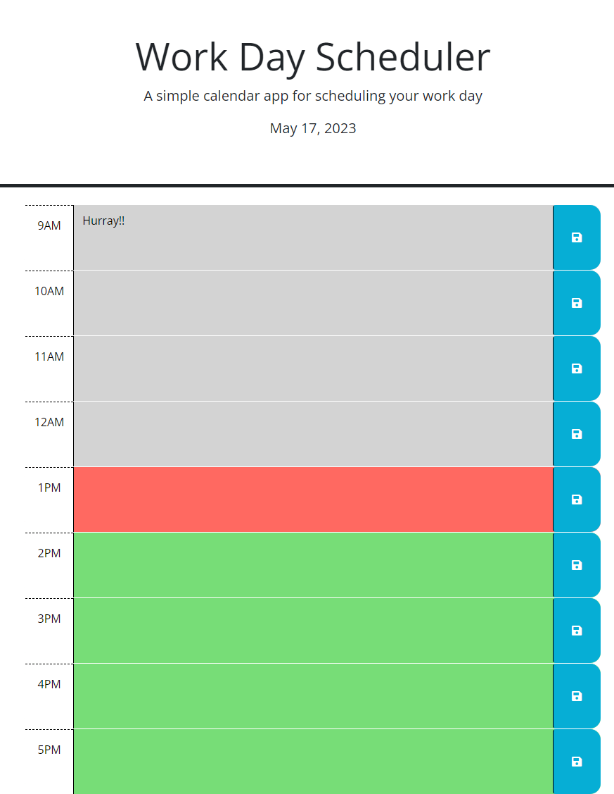

# Work Day Scheduler
## About
In this project, I was given starter code for a work day scheduler. I had to incorperate Day.js to display the current day and append the hour classes to change the color of the hour block according to whether it is past, present, or future. Next, I added code to make the save button save to local storage and upon refeshing the page, each time block is populated with data from local storage. I struggled with getting my function to not duplicate saved data for each hour slot, but eventually was able to set ave only one slot per hour. 
## Screenshots

## Links
Open [https://potteramy.github.io/word-day-scheduler/](https://potteramy.github.io/word-day-scheduler/) with your browser to see the result.